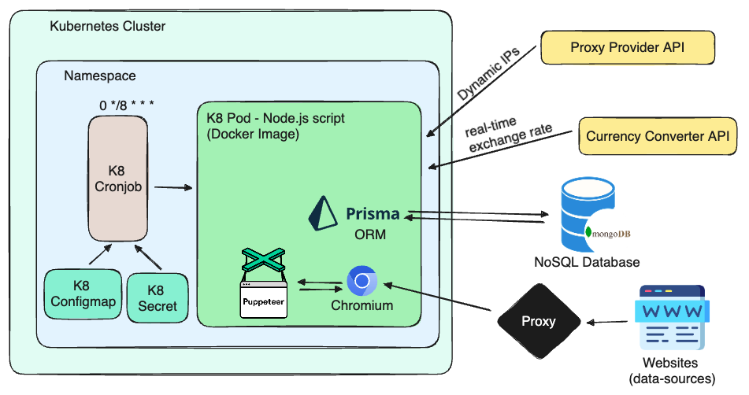

# MS-VMOTOR-JOBS

Scripts for sync vehicle information from different websites

## Jobs Architecture


## Pre-requisites (Local)

1. Node.js v20.10.0 or or higher
1. Chromium (Google Chrome brings it)

## Installation (Local)

```bash
npm run install
```

## Running script (Local)

```bash
# generates prisma schema and generate types
$ npm run pull:database

# traspile .ts to .js and minify files
$ npm run build

# run script
$ npm run start
