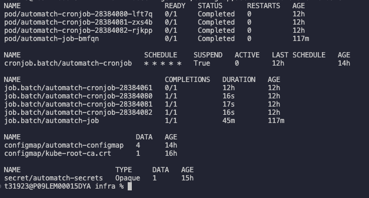

## Deploy CronJobs kubernetes Infrastructure

1. Deploy Cronjob infra
    ```bash
    # Setup kubernetes resources
    $ npm run k8:deploy

    # verify all resources where created (OPTIONAL)
    $ kubectl get all,cronjob,configmap,secret -n automatch
    ```

    
